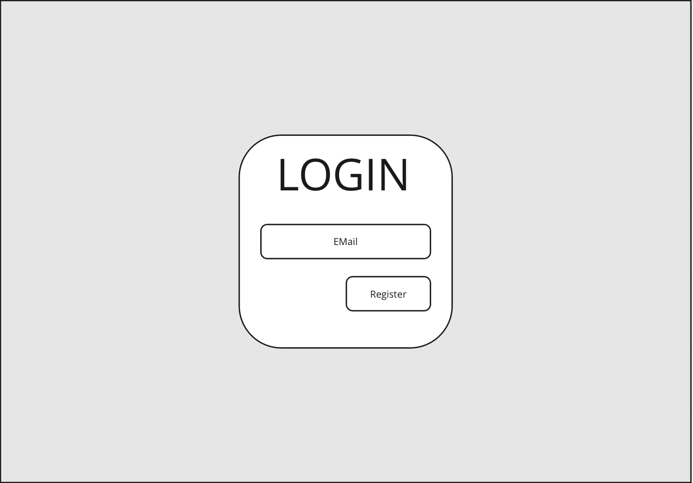
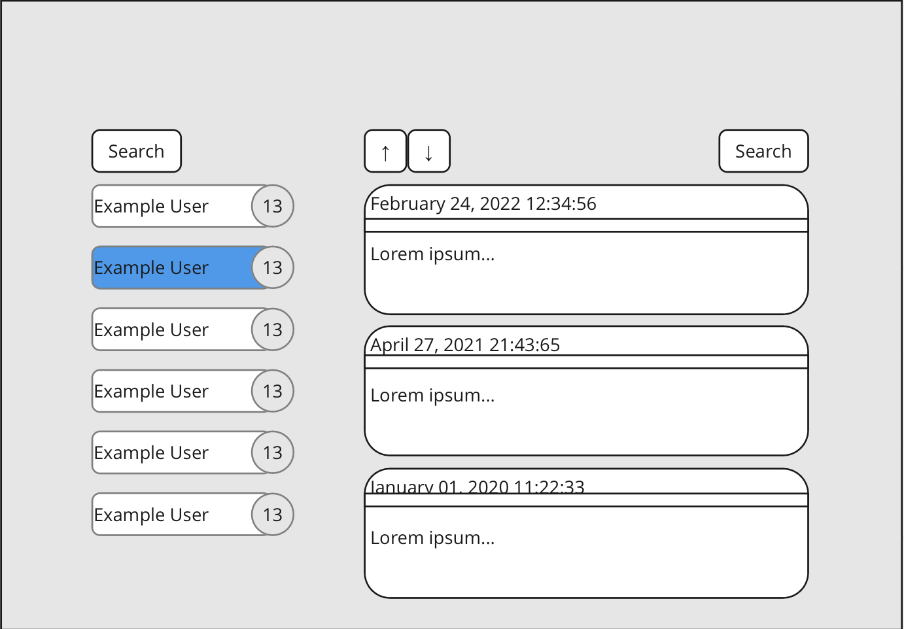

# Xometry Frontend Assignment

Welcome to Xometry frontend assignment! We're happy to see you here.

The purpose of this assignment is to help evaluate your React and front-end development skills. We use this assignment
to determine the level of your coding and where you might fit in our developer stack. There is no wrong answer or wrong
way of doing this. Please try to do this by yourself. This task may take up to between 3-5 hours and should be done in
Typescript. The final submission should meet production quality standards.

## Task

- Create a simple post reader as a React SPA.
- Implement above using React components and CSS.
- Retrieve the data shown in the app from the API described below.
- Concentrate on functionality, code quality (CSS and TS) and testability, not visual design.
- Any common state management, routing and/or testing library can be used.
- Using CSS toolkits and UI frameworks (bootstrap etc) is not ok. The purpose is to evaluate your coding skills, not npm skills.
- We prefer not to use any styled-components libraries.

Must haves:
- Login Screen with email input.
- Sender list with sender name and post count ordered by name alphabetically.
- Clicking on a sender opens that sender's posts in the post list view.
- Post list where posts are ordered by creation time.
- Post order buttons to allow choosing most recent first and most recent last ordering for posts list

Nice to haves:
- Search box for senders. Any senders whose name do not contain the text entered are hidden
- Search box for posts. Any posts that do not contain the text entered are hidden
- Deep-linkable post list. This means that it is possible to enter a URL that directly selects the sender whose posts are shown.
- Responsive design.

## Rough Design



## API

1. Use the following endpoint to register a user:

   **GET:** `http://localhost:1338/register`

   **PARAMS:**
   
    ```
    *email:* User's email from login screen
    ```

   **RETURNS**

    ```
    *user:* Created user entity.
    ```

2. Use the following endpoint to fetch posts:

   **GET:** `http://localhost:1338/posts`

   **PARAMS:**

    ```
    *token:* Token from registered user.
 
    *page:* Integer page number of posts, optional.
   
    *per_page* Number of posts per page, optional.
    ```

   **RETURNS:**

    ```
    *page:* What page was requested.
 
    *posts:* Posts.
   
    *pages:* Number of pages .
    ```

Author: [Xometry Europe](https://xometry.eu)